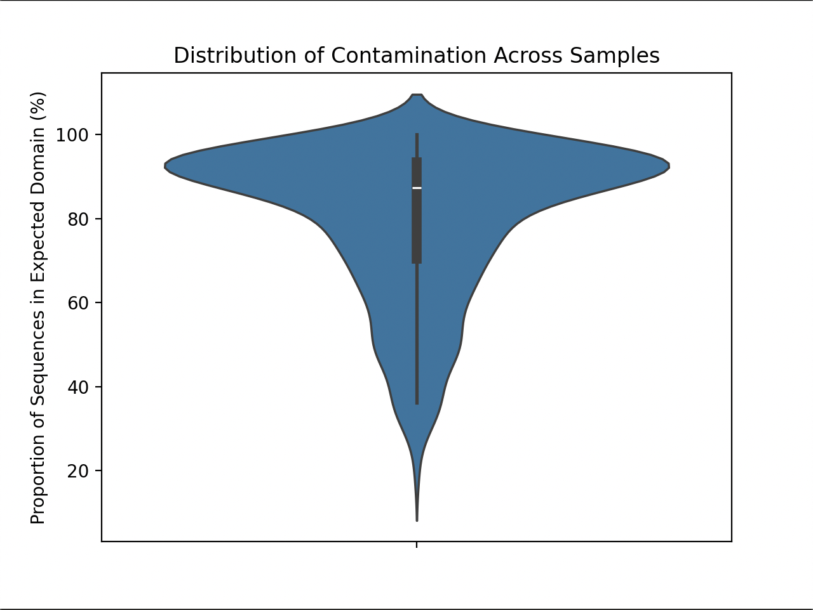

# Overview

Generated figures based on contamination clade summary tables using python

# Goals

- Test 1
- Goal 2
- Goal 3

## Procedures
1.  Download SRA_Contamination_Clade_Summaries_March_03_2026 (1).zip
2.  Run Python code on terminal (see below)


# Figure Generation Code

```{{python}}
import matplotlib.pyplot as plt
import seaborn as sns
from collections import defaultdict

contam_csvs = glob.glob('SRA_Contamination_Clade_Summaries_March_03_2026/*Major*.csv')
domains = defaultdict(dict)
crap_csvs = []

for csv in contam_csvs:
    try:
        df = pd.read_csv(csv)
    except:
        crap_csvs.append(csv)
        continue

    same_counts = int(df[df['Sister_Counts'] == "SAME"].Domain.values[0])
    total_counts = int(sum(df.Domain.values))
    taxon = csv.rpartition("/")[1].partition(".")[0]

    domains[taxon]['Total_Seqs'] = total_counts
    domains[taxon]['Same_Domain'] = same_counts
    domains[taxon]['Diff_Domain'] = total_counts - same_counts
    domains[taxon]['Proportion_Same_Domain'] = 100 * same_counts / total_counts

domain_df = pd.DataFrame(domains).T

sns.jointplot(data=domain_df, y='Total_Seqs', kind="kde")
plt.yscale('log')
plt.xscale(0, 100)
plt.show()

sns.violinplot(data=domain_df, y='Proportion_Same_Domain')
plt.show()

sns.distplot(data=domain_df, x='Total_Seqs', bins=[25, 50, 100, 125, 150, 175, 200])
plt.show()
```

# Results

{width=70% .lightbox}


# Next Steps

- [ ] Analyze generated plots and brainstorm contamination rules based on results
- [ ] Start writing results section using plots

---
